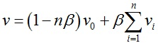
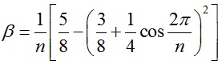

王宇伟 21721099 硕士研究生 一年级

# Loop Subdivision 算法实现

## 1. 编程环境

- C/C++ 
- Win10
- Visual Studio 2017

## 2. 数据结构

假设所有面片均为三角形。

- Face: 存储面片三个顶点。
- Vertex: 存储顶点三维坐标。
- tot_faces: 存储当前所有面片。
- tot_vertexes: 存储当前所有顶点。
- edge_vertexes: 为节省空间，以邻接表形式存储所有边结点以及其对顶点，方便计算新生成顶点位置。

## 3. 算法流程

Loop细分是一种三角形网格的细分法则，它按照1-4三角形分裂，每条边计算生成一个新的顶点，同时每个原始顶点更新位置。

### 3.1 网格内部V-顶点位置

设内部顶点v0的相邻点为v1、v2，…，vn，则该顶点更新后位置为，其中。

### 3.2 网格边界V-顶点位置

设边界顶点v0的两个相邻点为v1、v2，则该顶点更新后位置为v = 3/4 * v0 + 1/8 * (v1 + v2)。

### 3.3 网格内部E-顶点位置

设内部边的两个端点为v0、v1，相对的两个顶点为v2、v3，则新增加的顶点位置为v = 3/8 * (v0 + v1) + 1/8 * (v2 + v3)。

### 3.4 网格边界E-顶点位置

设边界边的两个端点为v0、v1，则新增加的顶点位置为v = 1/2 * (v0 + v1)。

## 4. 程序说明

Loop程序为 Loop Subdivision 算法实现

segmented_scan_line程序为区间扫描线算法实现，用以显示实验结果

Loop程序默认加载文件为model.obj（四面体），生成若干个model_divX.obj文件，X表示迭代细分的次数。迭代中止条件为以下任意一个：

- 迭代达8次。
- 顶点个数已达400000或以上。
- 面片个数已达800000或以上。

## 5. 实验结果

win10下可使用系统自带的Print 3D等软件打开obj文件，也可以使用提供的区间扫描线算法程序读取并显示。

###5.1 Print 3D 结果

###5.2 区间扫描线程序使用说明

将 *.obj 文件移动至 models 文件夹下，编译并运行即可。

#### 5.2.1 鼠标交互

- 按下鼠标左键：模型以鼠标点击位置与画面中心位置为旋转轴持续旋转，释放左键则停止旋转。
- 按下鼠标右键：选择models文件夹下的 *.obj 模型文件进行绘制。
- 鼠标滚轮可调整模型尺度大小，上滚放大，下滚缩小。

#### 5.2.2 控制台交互

- 控制台显示当前绘制的 *.obj 文件信息、文件加载时间和算法用时等信息。

